# 马铃薯病害多Agent智能诊断系统

基于 LangGraph Multi-Agent 架构的马铃薯病害智能诊断平台。用户上传叶片图片，系统自动完成病害检测、环境感知、风险评估、知识检索，生成治疗建议和动态防治工作流。

## 系统架构

```
用户（浏览器）
    │
    ▼
Flask Web App
    │
    ├── 快速模式：直接函数调用 → YOLO → 风险引擎 → LLM 报告（<5s）
    │
    ├── Supervisor 模式：LangGraph 编排三个 ReAct Agent
    │   ├── Diagnosis Agent ──→ YOLO 检测 + 病害知识库
    │   ├── Risk Agent ──────→ 气象 API + 风险评分引擎
    │   └── Treatment Agent ─→ ChromaDB RAG + SOP + LLM 建议
    │
    └── StateGraph 模式：原生 StateGraph + Checkpointer
        START → detect → disease_info → weather → risk → treatment → update_history → END
```

### 三种运行模式

| 模式 | 实现方式 | 响应时间 | 特点 |
|------|---------|----------|------|
| **快速模式** | 直接函数调用 + LLM 报告 | < 5s | 默认模式，性能优先 |
| **Supervisor 模式** | `langgraph_supervisor` 编排三个 ReAct Agent | ~15s | 完整 Tool Calling 链路 |
| **StateGraph 模式** | 原生 `StateGraph` + `Checkpointer` | ~10s | 条件边分支 + 多轮对话记忆 |

### 多轮对话

基于 LangGraph Checkpointer 实现用户级状态持久化：

- 通过 `thread_id` 关联同一用户的多次诊断
- 每轮诊断完成后自动保存摘要到 `conversation_history`
- LLM 生成建议时注入历史上下文，支持连续追问
- Flask session 自动管理 `thread_id`

## 技术栈

| 层级 | 技术 | 用途 |
|------|------|------|
| Agent 框架 | LangGraph（StateGraph / Supervisor / Checkpointer） | Multi-Agent 编排、状态持久化 |
| Agent 模式 | ReAct Agent + Function Calling | LLM 自主决策工具调用 |
| 大语言模型 | DeepSeek Chat | 诊断建议生成 |
| 向量数据库 | ChromaDB | 农业知识语义检索 |
| Embedding | BAAI/bge-small-zh-v1.5 | 中文文本向量化 |
| 目标检测 | YOLOv8n（Ultralytics） | 叶片病斑检测 |
| Web 框架 | Flask + Jinja2 | 后端路由、模板渲染 |
| 外部 API | OpenWeatherMap | 实时气象数据 |

## 快速开始

### 1. 安装依赖

```bash
pip install flask ultralytics langchain langchain-openai langgraph langgraph-checkpoint chromadb sentence-transformers requests python-dotenv
```

### 2. 配置 API Key

创建 `.env` 文件：

```env
DEEPSEEK_API_KEY=your_deepseek_api_key
DEEPSEEK_BASE_URL=https://api.deepseek.com
OPENWEATHER_API_KEY=your_openweather_api_key
```

### 3. 启动应用

```bash
python app.py
```

浏览器访问 `http://localhost:5000`。

## 效果展示

### 数据看板

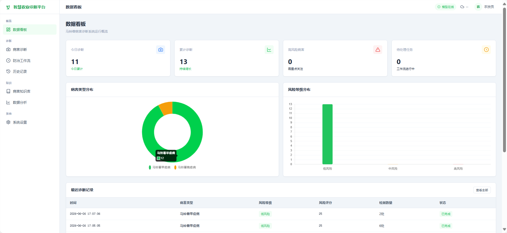

### 病害知识库

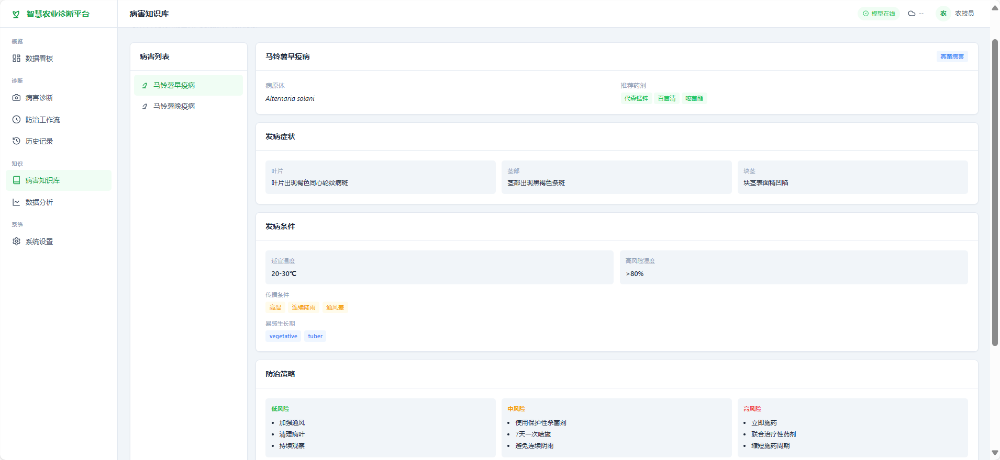

### 快速模式诊断

| 检测结果 | 风险分析 | AI 诊断报告 |
|:---:|:---:|:---:|
| 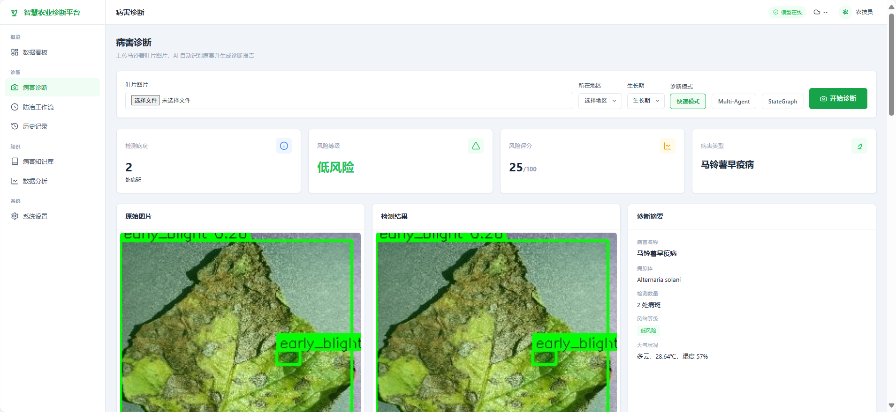 | 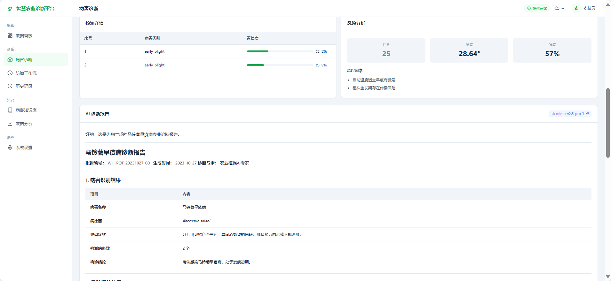 | 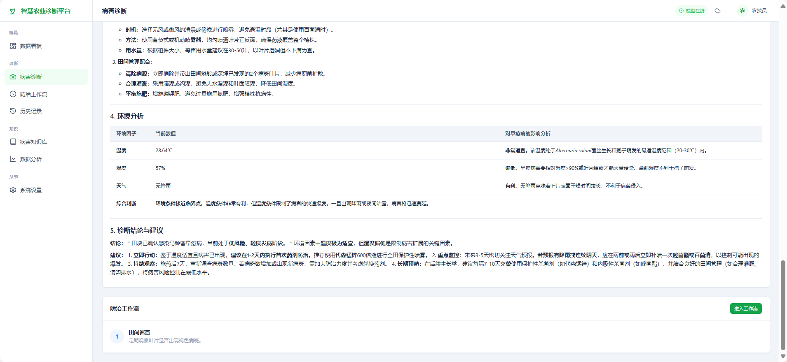 |

### Multi-Agent 协作诊断

| Supervisor 流程 | Agent 详细步骤 | 最终报告 |
|:---:|:---:|:---:|
| 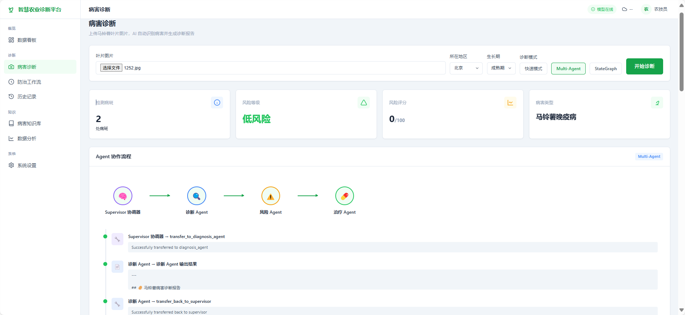 | 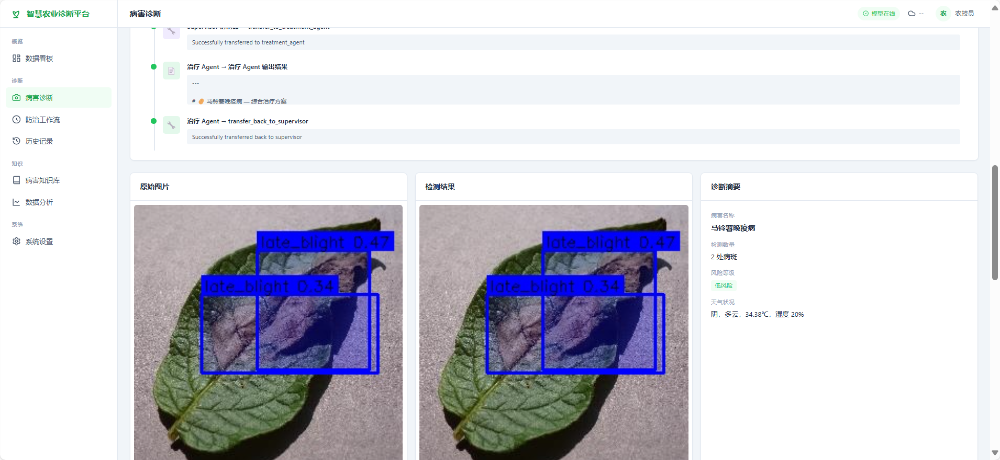 | 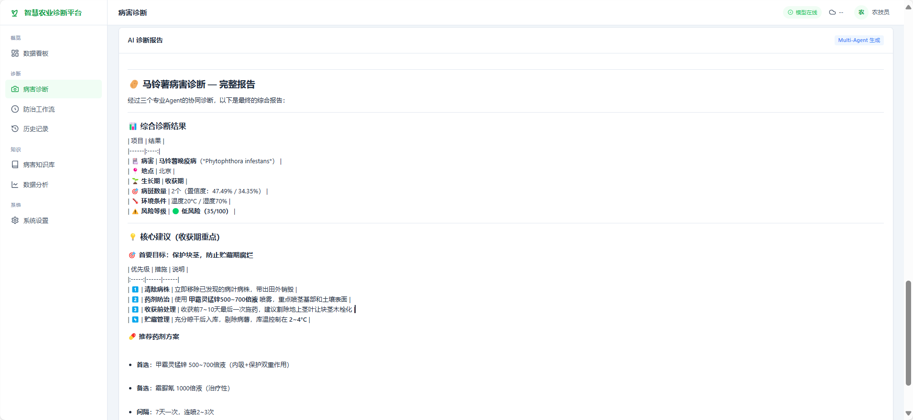 |

### StateGraph 诊断

| StateGraph 流程 | 检测详情 + 风险分析 |
|:---:|:---:|
| 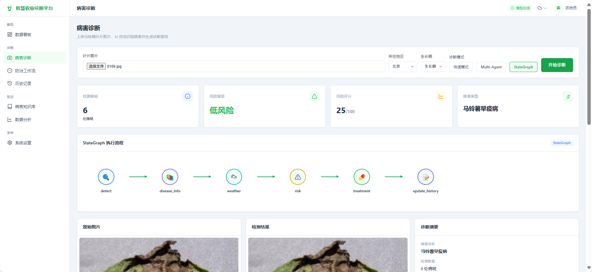 | 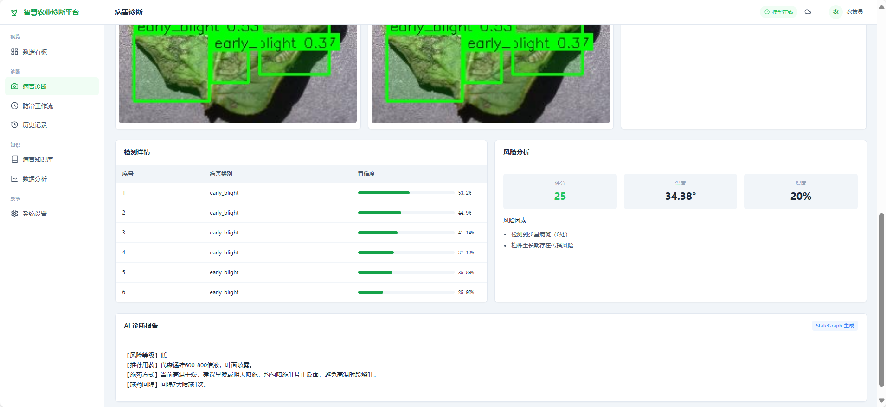 |

### 防治工作流

| SOP 标准流程 | 动态调整 | 执行反馈 |
|:---:|:---:|:---:|
| 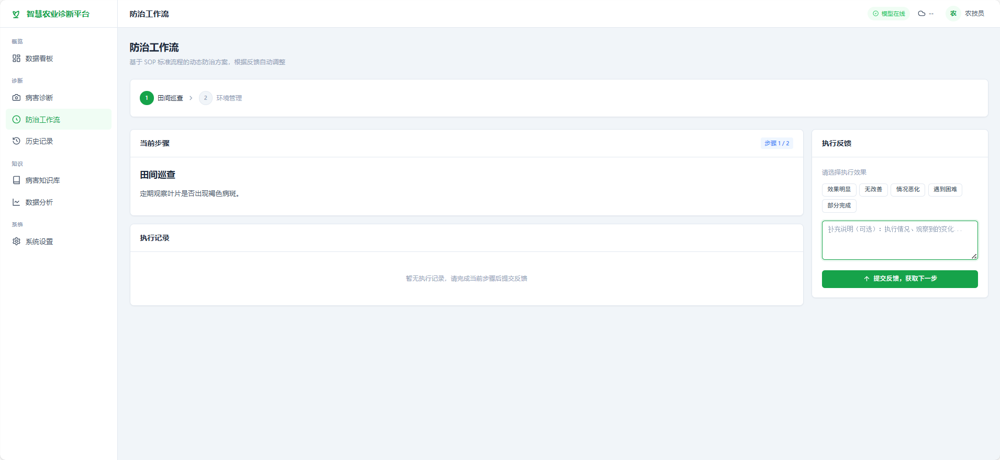 | 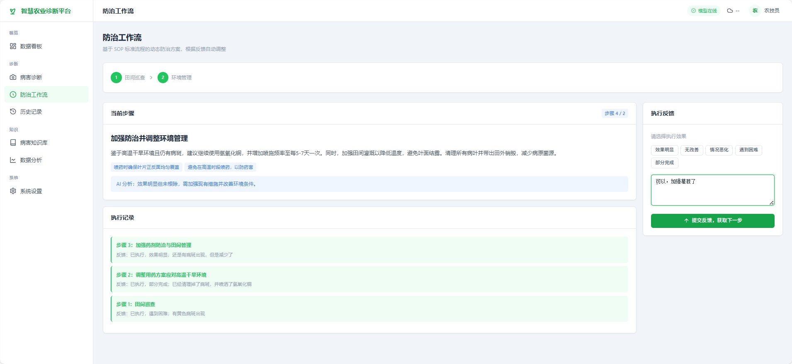 | 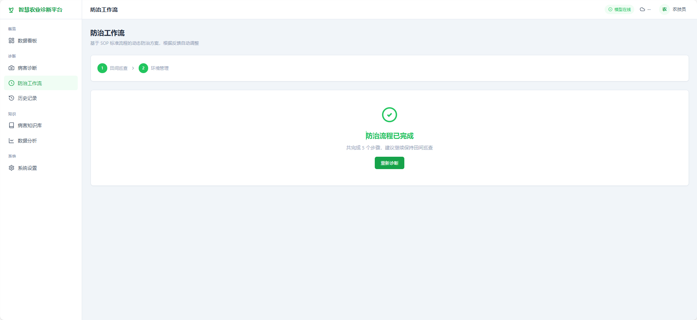 |

## 项目结构

```
potato_disease_project/
├── app.py                          # Flask 应用入口
├── train.py                        # YOLOv8 训练脚本
│
├── agents/                         # Multi-Agent 模块
│   ├── supervisor.py               # Supervisor 编排器 + 快速模式入口
│   ├── langgraph_diagnosis.py      # 原生 StateGraph（Checkpointer + 多轮对话）
│   ├── diagnosis_agent.py          # 诊断 Agent（ReAct）
│   ├── risk_agent.py               # 风险评估 Agent（ReAct）
│   ├── treatment_agent.py          # 治疗 Agent（ReAct）
│   └── tools.py                    # @tool 工具函数
│
├── ai/                             # LLM 集成
│   ├── llm_agent.py                # DeepSeek 调用（主用）
│   ├── agent.py                    # DeepSeek 调用（备用）
│   └── rag_retriever.py            # 快速模式字典检索
│
├── rag/                            # RAG 向量检索
│   ├── vectorstore.py              # ChromaDB + Embedding 模型
│   ├── retriever.py                # 语义检索接口
│   └── ingest.py                   # 数据入库脚本
│
├── knowledge/                      # 知识库
│   ├── disease_db.py               # 病害信息
│   ├── pesticide_db.py             # 农药数据
│   ├── sop_db.py                   # SOP 标准流程
│   └── disease_normalizer.py       # 标签标准化
│
├── engine/                         # 业务引擎
│   ├── decision_engine.py          # 风险评分引擎
│   └── workflow_engine.py          # 动态工作流引擎
│
├── yolo/                           # YOLO 检测
│   └── predict.py                  # 推理接口
│
├── utils/                          # 工具
│   └── weather_api.py              # 气象 API 封装
│
├── templates/                      # Jinja2 模板
├── static/                         # 静态资源
├── models/                         # YOLO 模型权重
├── dataset/                        # 训练数据集
├── docs/                           # 项目文档 + 截图
└── .env                            # API 密钥（不提交）
```

## License

本项目仅供学习和研究使用。
